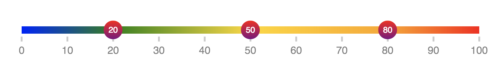

<!-- <a href="https://travis-ci.org/react-tools/react-ranger" target="\_parent">

</a> -->

<a href="https://spectrum.chat/react-ranger">
  
</a>
<a href="https://npmjs.com/package/react-ranger" target="\_parent">

</a>
<a href="https://github.com/react-tools/react-ranger" target="\_parent">

</a>
<a href="https://twitter.com/tannerlinsley" target="\_parent">

</a>

<br />
<br />

# React Ranger 🎛



A headless render-prop component for building range and multi-range sliders in React

- 2kb gzipped. Wow!
- Render-Prop pattern allows you to render and style the slider however you want.

## Examples

- [Codesandbox.io](https://codesandbox.io/s/l5nnjl7jqm) (contains all examples below)
  - Simple
  - Custom Components
  - Multi-Range
  - Custom Steps

## Chat with us on Spectrum!

Need Help? [Click here to sign up for the React-Tools Spectrum community](https://spectrum.chat/react-ranger). We are constantly discussing implementation details and answering questions. :)

## Installation

```bash
$ yarn add react-ranger
# or
$ npm install --save react-ranger
```

## Sample Usage

The following is a very basic example of a single range input that looks similar to Chrome's default appearance.

```javascript
import ReactRanger from "react-ranger";

class SimpleExample extends React.Component {
  state = {
    value: 5
  };
  render() {
    const { value } = this.state;
    return (
      <ReactRanger
        min={0}
        max={100}
        stepSize={5}
        value={value}
        onChange={value =>
          this.setState({
            value
          })
        }
      >
        {({ getTrackProps, handles }) => (
          <div
            {...getTrackProps({
              style: {
                height: "4px",
                background: "#ddd",
                boxShadow: "inset 0 1px 2px rgba(0,0,0,.6)",
                borderRadius: "2px"
              }
            })}
          >
            {handles.map(({ value, active, getHandleProps }) => (
              <div
                {...getHandleProps({
                  style: {
                    width: "12px",
                    height: "12px",
                    borderRadius: "100%",
                    background:
                      "linear-gradient(to bottom, #eee 45%, #ddd 55%)",
                    border: "solid 1px #888"
                  }
                })}
              />
            ))}
          </div>
        )}
      </ReactRanger>
    );
  }
}
```

## Props

- `children: func.isRequired` A Function as a child that receives the following props:
  - `getTrackProps(userProps): func` - A function that takes optional props and returns the combined necessary props for the track component.
  - `ticks: array` - Ticks to be rendered. Each `tick` has the following props:
    - `value: number` - The tick number to be displayed
    - `getTickProps(userProps): func` - A function that take optional props and returns the combined necessary props for the tick component.
  - `segments: array` - Segments to be rendered. Each `segment` has the following props:
    - `value: number` - The segments ending value
    - `getSegmentProps(userProps): func` - A function that take optional props and returns the combined necessary props for the segment component.
  - `handles: array` - Handles to be rendered. Each `handle` has the following props:
    - `value: number` - The current value for the handle
    - `active: boolean` - Denotes if the handle is currently being dragged.
    - `getHandleProps(userProps): func` - A function that take optional props and returns the combined necessary props for the handle component.
  - `activeHandleIndex: oneOfType([null, number])` - The zero-based index of the handle that is currently being dragged, or `null` if no handle is being dragged.
- `min: number.isRequired` - The minimum limit for the range
- `max: number.isRequired` - The maximum limit for the range
- `value: oneOfType([number, arrayOf(number)]).isRequired` - The current value (or values) for the range
- `interpolation: oneOf(['linear', 'logarithmic'])` - The interpolation method to use. Defaults to `'linear'`. Note that logarithmic interpolation only works for positive values
- `stepSize: number.isRequired` - The distance between selectable steps
- `steps: arrayOf(number)` - An array of custom steps to use. This will override `stepSize`,
- `tickSize: number`
- `ticks: arrayOf(number): Default: 10` - An array of custom ticks to use. This will override `tickSize`,
- `onChange: func` - A function that is called with the following parameters:
  - `newValue` - The new value or values for the range
- `onTrackClick: func` - A function that is called when the tracked is clicked with the following parameters:
  - `stepValue` - The value that was clicked, but rounded to the nearest step.
  - `preciseValue` - The value that was clicked, with decimal precision.
- `onPress: func` - A function that is called when a handle is pressed.
- `onDrag: func` - A function that is called when a handled is dragged.
- `onRelease: func` - A function that is called when a handle is released.

## Contributing

We are always looking for people to help us grow `react-ranger`'s capabilities and examples. If you have an issue, feature request, or pull request, let us know!

## License

React Ranger uses the MIT license. For more information on this license, [click here](https://github.com/react-tools/react-ranger/blob/master/LICENSE).
